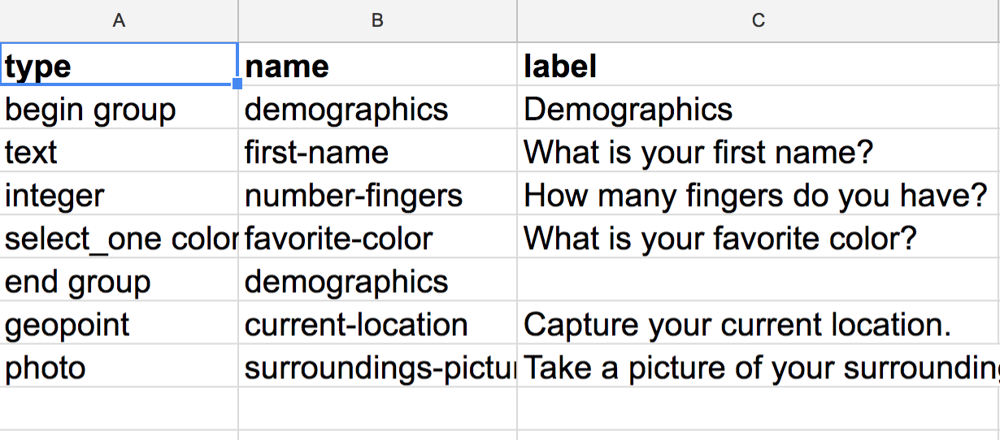
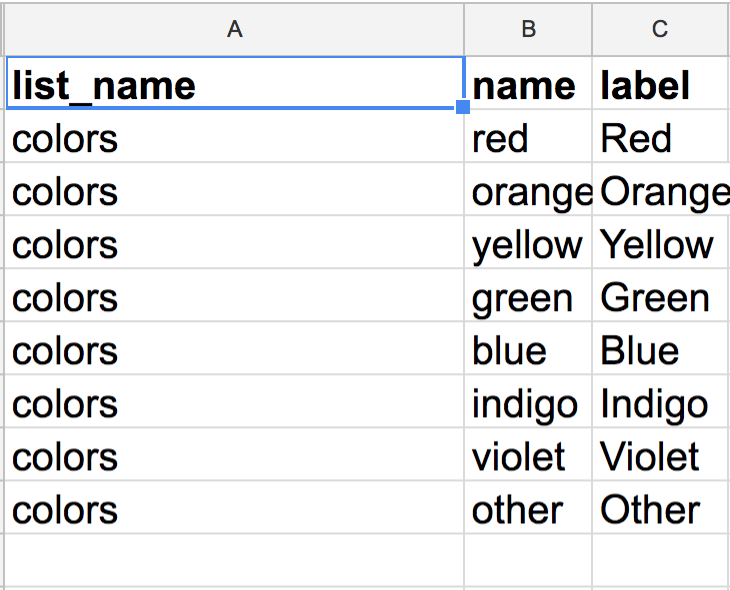
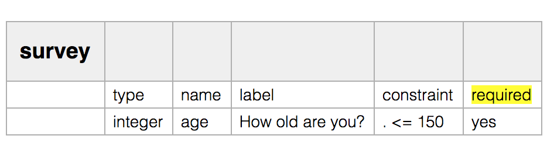
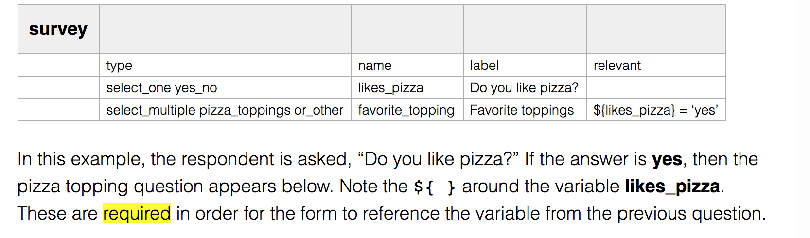
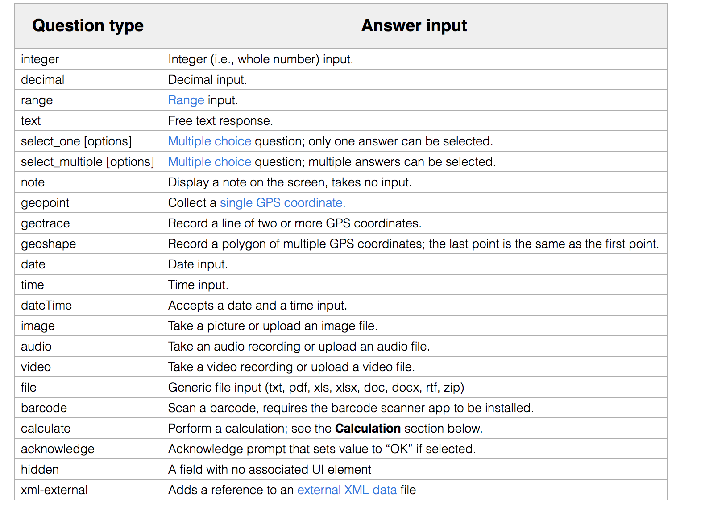

# Open Data Kit

### What is ODK?

ODK ရဲ့အရှည်နာမည်ကတော့ Open data kit ပါ။ သူ့ကို ဆာဗေးပြုလုပ်ဖို့ ဒေတာကောက်ဖို့အတွက် သုံးလေ့ရှိပါတယ်။ သိသာတဲ့ use case ကတော့ ဆာဗေးကောက်မယ့်သူတွေက ဖုန်းထဲမှာ ODK collect ထည့်ထားမယ်။ ပြီးတော့ ကိုယ်ကောက်ချင်တဲ့ ဖောင်ကို လည်းထည့်ထားမယ်။ ပြီးတော့ တကယ်ကောက်မယ့်နေရာထိ သွားပြီး လိုအပ်တဲ့အချက်အလက်တွေကို Gps address, အသံဖိုင်၊ ဓာတ်ပုံတွေနဲ့တကွကောက်ယူလို့ရမယ်။ ကောက်ယူမယ့်သူရဲ့ device id နဲ့အခြားအချက်အလက်တွေကိုပါတစ်ပါတည်း ဆာဗာကိုလှမ်းပို့နိုင်မယ်။ ဒါကြောင့် လုံးဝ စာရွက်နေရာကိုအစားထိုးလိုက်လို့ရတာပေါ့။

### How it works?

ဒါပေမယ့် ODK မှာ Form ပြုလုပ်ရတာ မလွယ်ဘူးဗျ ။ Google Form တို့မှာလို ပြုလုပ်ရလွယ်တာမဟုတ်ဘူး။  ဒါကြောင့် ဘယ်လိုအလုပ်လုပ်လဲဆိုတာတော့ သိဖို့လိုတယ်။Form တည်ဆောက်ဖို့ Xls form ဆိုတဲ့ excel မှာတည်ဆောက်လို့ရတဲ့ form format ကိုသုံးတယ်။ အဲဒီဟာကလည်း သူ့ဘာသာ သီးသန့်language တစ်ခုလိုရှိတယ်။ Drag and drop တွေရှိပေမယ့် တကယ်တမ်းအဆင်သိပ်မပြေလို့ ကိုယ်တိုင် excel or google sheet ပေါ်မှာ ဆောက်တာပဲ ပိုကောင်းပါတယ်။

### Creating XLSForm

**Form ကို Google Sheet မှာပဲဖြစ်ဖြစ် excel မှာ ဖြစ်ဖြစ်တည်ဆောက်လို့ရပါတယ်။အဓိက. Sheet ထဲမှာ tab3 ခုပါဖို့လိုတယ်။**

#### Essential Tabs



survey ထဲမှာ ပါဝင်ရတဲ့ Column တွေကတော့ type, name နဲ့ label ပါပဲ ။  
နာမည်တွေမမှားအောင် ဂရုစိုက်ပေးပါ။

**Type** ကတော့ ကိုယ်မေးချင်တဲ့မေးခွန်းရဲ့အဖြေအမျိုးအစားကိုဖော်ပြတယ်။ဥပမာ- ကိုယ်မေးချင်တာက ဂဏန်းပဲလား ၊ ဒါဆို integer ကိုသုံးတယ်။ ဒဿမပါလား။ ဒါဆို decimal သုံးတယ်။ စာပဲဆိုရင်တော့ text လို့ရေးတယ်။ ကိုယ့်ရဲ့ ဒေတာအမျိုးအစားကို ကြေငြာပေးရတာပေါ့။  
**name** ကတော့ မေးခွန်းရဲ့ အမည်ပေါ့ ။ သူက ဆာဗေးကောက်လိုက်လို့ ရတဲ့ ဒေတာtable ထဲမှာ ပေါ်မှာ ၊ column ရဲ့နာမည်အဖြစ် လာပေါ်တယ်။

**label** ကတော့ မေးခွန်းအပြည့်အစုံအရှည်ကြီးပေါ့။ ဒါကတော့ တကယ့်ဖုန်းထဲမှာ မေးခွန်းမေးရင် ပေါ်မယ့်စာ ။



choices ထဲမှာပါရတာကတော့  **list name**, **name**, နဲ့ label ပါ။   
နာမည်တွေမမှားအောင် ဂရုစိုက်ပေးပါ။

**list\_name** ကတော့ Multiple Choice Questions တွေ ၊ ရွေးချယ်စရာအများကြီးထဲက တစ်ခုရွေးရတာမျိုးတွေမှာ အသုံးပြုပါတယ်၊ အသေးစိတ်လုပ်နည်းသိမှ နားလည်မှာပါ။ 

**name** ကတော ရှေ့က survey မှာလိုမျိုးပဲ ဒေတာ table ထဲမှာပေါ်မယ့်နာမည်ပါ၊

**label** ကတော့ ဒေတာကောက်တဲ့သူ ဆီမှာတကယ် ပေါ်မယ့်အမည်ပါ 



  



နောက်ထပ် column တွေထပ်တိုးလို့ရတယ်။ သူတို့က တော့ အမြဲလိုအပ်တာတော့မဟုတ်ဘူး။ ကိုယ့်ရဲ့မေးခွန်းကို အသေးစိတ်ထပ်ပြင်ဆင်ချင်တဲ့အခါမျိုးမှာပဲလိုတာ။ ဥပမာ မေးခွန်းက ဖြေကိုဖြေရမှာမျိုးလား။ ဒါဆို required  ဆိုတဲ့ column တစ်ခုထပ်ထည့်ပေးပြိး yes လို့ပြောထားရတယ်။​  

#### Additional Columns

ဒါမှမဟုတ် မေးခွန်းတစ်ခုနဲ့တစ်ခုချိတ်ချင်လား။ ဥပမာ . မေးခွန်း၁မှာ ဟုတ်တယ်ဆိုတဲ့အဖြေပးမှ မေးခွန်း၂ကို ပြပြီးဖြေခိုင်းမှာမျိုး။ ဒါဆိုရင်တော့ relavant ဆိုတဲ့ column လေးသုံးရတယ်။  
****

**အသေးစိတ်တွေကိုတော့ ပေးထားတဲ့လင့်တွေကနေကြည့်လို့ရတယ် ။** [**http://xlsform.org/**](http://xlsform.org/) **မှာ အသုံးအနှုန်းတွေကိုလေ့လာလို့ရတယ်။ ဒေတာ format တွေကိုကြည့်လို့ရတယ်​၊ အောက်မှာပါသလိုပေါ့။**  

### Converting XLSForm to XLM

ဖောင်ဆောက်ပြီးရင်တော့ xlm format ကိုပြောင်းပေးရတယ်။ အဲဒီတော့ excel file . Xls ကို ဒီwebsite [http://opendatakit.org/xiframe/](http://opendatakit.org/xiframe/) ပေါ်တင်ပြီး xlm အဖြစ်convert လုပ်ပေးရတယ် ၊ ဘာကြောင့်လဲဆိုတော့ Open Data . Kit ထဲမှာ ထည့်ပြီး အသုံးပြုမယ်ဆိုရင် XLM format နဲ့မှ အသုံးပြုလို့ရတာကြောင့် ဖြစ်တယ်။ သတိထားရမှာတော့ ကိုယ်လုပ်လို့ဖြစ်တဲ့ အမှား error မှန်သမျှ ဒီ xls ကနေ xlm အဖြစ်ပြောင်းတဲ့နေရာမှာ လာပေါ်တယ်။ ဒါကြောင့် ဘယ်နားမှားနေလဲပြန်စစ်လို့ရတယ်။  

### ODK+Google Sheet

**များသောအားဖြင့် ODK ကို Offline ပဲသုံးပေမယ့်Google sheet နဲ့တိုက်ရိုက်ချိတ်ထားလို့လည်းရတယ်။အောက်မှာပေးထားတဲ့လင့်ကနေဝင်ကြည့်ရင်တော့ဘယ်လိုလုပ်ရမလဲသိမှာပါ။**  
[**https://www.google.com/earth/outreach/learn/odk-collect-and-google-drive-integration-to-store-and-manage-your-data/**](https://www.google.com/earth/outreach/learn/odk-collect-and-google-drive-integration-to-store-and-manage-your-data/)  

### Recommending Kobotoolbox 

တကယ်တော့ အပေါ်က အဆင့်တွေက စတင်အသုံးပြုမယ့်သူအတွက် အတော် ရှုပ်ထွေးပါတယ်။ ဖောင်တည်ဆောက်ရမှာ အခက်အခဲတွေအများကြီး တွေ့နိုင်တဲ့ အပြင် error တွေ တစ်ပုံကြီးတက်ပါလိမ့်မယ်။ ပြီးတော့ မြေပြင်ကိုဆင်းပြီး ဒေတာကောက်သူတွေဆီက အချက်လက်တွေကို အင်တာနက်က တဆင့် တိုက်ရိုက် သိမ်းဖို့အတွက် google sheet ကို ပြင်ဆင်ရ ထိန်းသိမ်းရတာလည်း လက်ဝင်ပါတယ်။​ဒါကြောင့် သူ့အစား အသုံးပြုဖို့ Kobotoolbox ဆိုတာရှိပါတယ်။ သူ့ကို အစိုးရဌာနတွေမှာလည်း kobomyanmar ဆိုပြီး အသုံးပြုကြပါတယ်။ အထူးသဖြင့် ရခိုင်ပြည်နယ်ဘက်မှာ အချက်အလက် ကောက်ဖို့အတွက်ပေါ့ ။  ​အဲဒီအတွက် သီးသန့် စာတစ်ခုထပ်ရေးပေးပါမယ်။ ကိုယ်တိုင်လေ့လာချင်ရင်တော့ [www.kobotoolbox.org ](http://www.kobotoolbox.org/)ပါ

