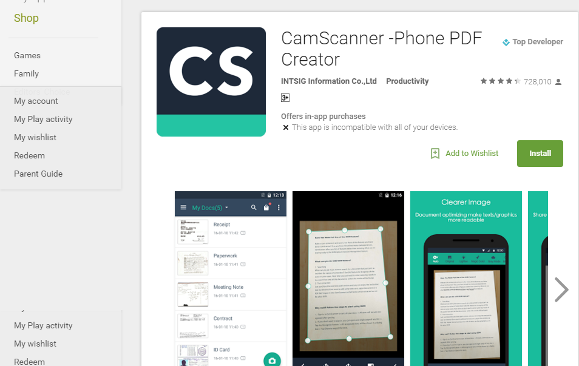
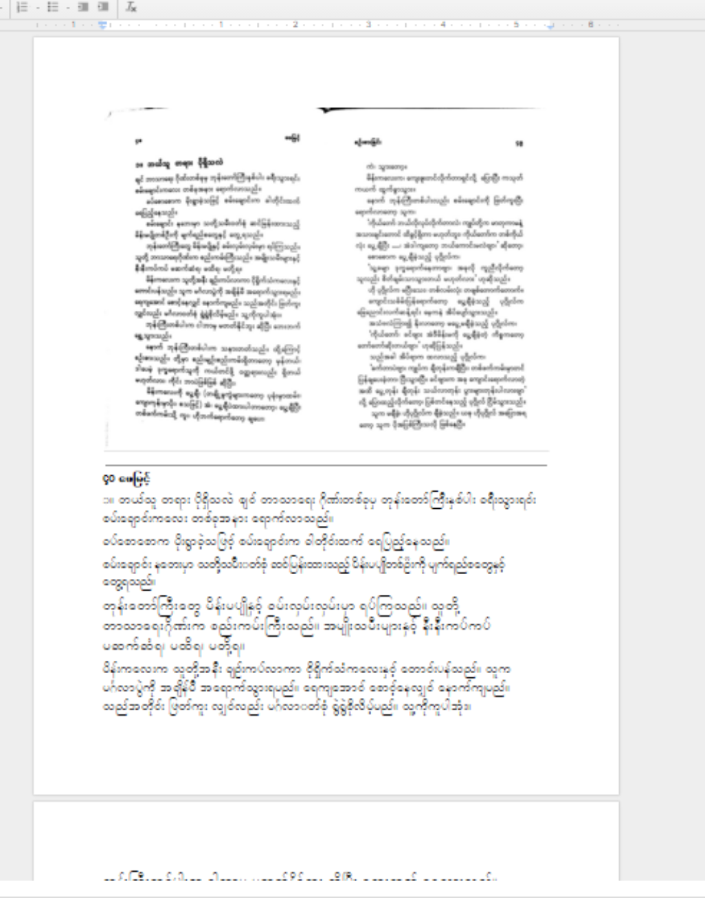

# Using Google OCR for Myanmar Lang

> **\(update: March 2018 ကစပြီး မိုဘိုင်းဖုန်းတွေရဲ့ Google Lens မှာ အထက်ပါ OCR service ကို အသုံးပြုနိုင်ပါပြီ\)**

### Introduction

ကျွန်တော့်ဘေးမှာ ရှိတဲ့မြန်မာဘာသာ နဲ့ရေးထားတဲ့စာအုပ်တစ်အုပ်ကို ပုံနှိပ်စာလုံးကနေ အလွယ်တကူ ကွန်ပျူတာစာလုံးတွေအဖြစ် ပြုလွယ်ပြင်လွယ်လုပ်လို့ရဖို့ဆိုတာ ကျွန်တော့်အိမ်မက်ပါ။အင်္ဂလိပ်ဘာသာ နဲ့ရေးထားတာတွေကို တော့ ကွန်ပျူတာစာလုံးအဖြစ်ပြောင်းလို့ရပြီး မြန်မာစာ ကို ရဖို့ကို တော်တော်ကြာစောင့်ခဲ့ရပါတယ်။  
ကျောင်းသားဘဝတုန်းက စင်ဘီယွန် သုံးနိုကီယာဖုန်းသုံးစဉ်က လိပ်စာကတ်လေးတွေကို ဓာတ်ပုံရိုက်ပြီး အလွယ်တကူ ဖုန်းစာအုပ်ထဲ ထည့်သွားတာကို တော်တော်သဘောကျနှစ်သက်ခဲ့ဖူးပါတယ်။အခုတော့ ဒီထက်အဆင့်မြင့်တဲ့ နည်းစနစ်တွေပေါ်နေပါပြီ။အရင်ကလို မြန်မာ စာတွေကိုကွန်ပျူတာစာလုံးပြောင်းချင်ရင် အစအဆုံး တစ်အုပ်လုံး စာစီစာရိုက်ပြန်လုပ်ဖို့မလိုတော့ဘူးဆိုတာ ကို သိပြီးပြီးလား။  
တော်တော်များများကတော့ သိကြမယ်မထင်ပါဘူး။ ဒါပေမယ့် တကယ် ဖြစ်နိုင်ပါတယ်။  
Google Drive ထဲမှာ ပါတဲ့ လုပ်ဆောင်ချက်တစ်ခုနဲ့ ကျွန်တော်တို့ စကန်ဖတ်ထားတဲ့ မြန်မာစာတွေကို ကွန်ပျူတာစာလုံးပြောင်းလို့ရနေပါပြီ။  
ဒီနည်းစနစ်ကို အိုစီအာ \(OCR\) Optical Character Recognition အမြင်ဖြင့်စကားလုံးပုံရိပ်ကိုမှတ်သားခြင်း လို့ခေါ်ပါတယ်။  
ဒီအကြောင်းကို ကျယ်ကျယ်ပြန့်ပြန့် မြန်မာလို ရေးထားတာမရှိသေးတဲ့အတွက် အခြားသူတွေ အလုပ်တွင်ကျယ်အောင် အသုံးကျစေဖို့ ကျွန်တော်ရေးသား ဖော်ပြပေးလိုက်ရပါတယ်။

### Requirements

* စကန်နာ\(သို့မဟု\) မိုဘိုင်းဖုန်း စကန်နာ app
* Google Drive app 
* ကွန်ပျူတာ
* Google Account
* Myanmar Unicode Font\(Pyidaungsu or Myanmar3\)
* Google Chrome Browser
* အင်တာနက်

### How it works?

ကျွန်တော် ဒီဟာကို သုံးဖို့အတွက် လိုအပ်တာကတော့  
ကွန်ပျူတာ တစ်လုံးကတော့ လိုအပ်ပါတယ်။ ဘာလို့လဲဆိုတော့ လောလောဆယ်မှာ Google Drive က ဒီ လုပ်ဆောင်ချက်ကို application အနေနဲ့မထုတ်သေးလို့ဖြစ်ပါတယ်။  
နောက်တစ်ခုကတော့ စကန်ဖတ်ထားတဲ့ စာပါ။ ဓာတ်ပုံဖိုင်နဲ့ဖြစ်စေ pdf နဲ့ဖြစ်စေ Google Drive ထဲကို Upload တင်လိုက်ဖို့လိုပါတယ်။  
ကျွန်တော့်မှာ တော့ စကန်နာ မရှိတဲ့ အတွက် ရှိတဲ့ဖုန်းကို ပဲ စကန်နာ အဖြစ်အသုံးပြုပါတယ်။  
ကျွန်တော်အသုံးပြုတာကတော့ Google play ထဲမှာရှိတဲ့ Camscanner application လေးပါ။

### Step1 : Taking Picture

စကန်နာ စက်တွေက လူတိုင်းဆီမှာ မရှိတဲ့အတွက် ဖုန်းထဲကို Scanner app သွင်းပြီး တကယ့် scanner တစ်ခုအဖြစ် လုပ်ဆောင်ပါတယ်။

Camera ကို Scanner အဖြစ်အသုံးပြုတဲ့အခါမှာ  
လက်မငြိမ်တာ အလင်းအားနည်းတာ ၊အရိပ်ကျတာတွေကြောင့် စကန်ဖတ်တာကထွက်လာတဲ့ စာပေါ်မှာ ပုံမပြတ်သားတာတွေဖြစ်တတ်ပါတယ်။  
ဒါကြောင့် ကျွန်တော်က အတတ်နိုင်ဆုံးလက်ကိုငြိမ်အောင်ထား ကူးချင်တဲ့စာကို ဖုန်းကင်မရာနဲ့ချိန်တဲ့အခါ ရေပြင်ညီ အတိုင်းဖြစ်နေဖို့လည်းလိုပါတယ်။  
ပြီးတော့ ဖုန်းရဲ့ကင်မရာ Flash မီးကိုဖွင့်ပြီးရိုက်ပါတယ်။ ဒါမှပြတ်သားတဲ့စာလုံးတွေပေါ်မှာပါ။  
ပြီးရင်တော့ Application ကနေ လိုချင်တဲ့စာအပြည့်ပါအောင် ဘောင်တွေကိုပြန်လည်ချိန်ညှိရပါတယ်။ ပြီးရင်တော့ Scan ဖတ်ဖို့ အချောထုတ်လိုက်ပါတယ်။

### Step2 : Uploading to Google Drive

ကျေနပ်ပြီဆိုရင်တော့ app ထဲကနေပဲ Share ကနေတဆင့် Google Drive Account ထဲကို အင်တာနက်ကနေလှမ်းတင်လိုက်ပါတယ်။  

### Step3 : Use Google Doc to Digitize Images

ပြီးရင်တော့ တစ်ဖက်ကွန်ပျူတာမှာ [https://drive.google.com](https://drive.google.com/drive/u/0/) ကိုဖွင့်ပြီး အဆင်သင့်စောင့်နေပါတယ်။ Google Drive ထဲကို စကန်ဖတ်ထားတဲ့ ဓာတ်ပုံဖိုင်တွေရောက်ပြီဆိုရင်တော့ အဲဒီပုံပေါ်မှာ ညာဘက်ကလစ် \( Right Click\) နှိပ်ပြီး Google Docs ဆိုတာလေးကိုနှိပ်လိုက်ပါတယ်။  

ဒါကတော့ တင်ထားတဲ့ဓာတ်ပုံဖိုင်ကို စာအနေနဲ့ပြောင်းဖို့ အတွက်ပါ။ Jpeg ဓာတ်ပုံဖိုင်တွေအပြင် Pdf တွေကိုလည်းလက်ခံပါတယ်။  
ဒါပေမယ့်ကွာခြားချက်ကတော့ ဓာတ်ပုံဖိုင်ဆို ရင် သူက တင်ထားတဲ့ပုံကို ကူးပြောင်းလိုက်တဲ့စာနဲ့တွဲပြပါတယ်။ ဒါကြောင့် စာကို အချောဖတ်အမှားစစ်တဲ့အခါအသုံးဝင်ပါတယ်။ Pdf အဖြစ်ဆိုရင်တော့ ဓာတ်ပုံဖိုင်ကို မဖေါ်ပြဘဲ ပုံရိပ်ကနေ စာသားအဖြစ်ပြောင်းထားတာကိုပဲ တစ်ခါတည်းဖော်ပြပါတယ်။ 

### Step4 : Text-Proofing

နမူနာပုံကိုကြည့်လိုက်ပါ။ ဆရာဖေမြင့်ရဲ့စဉ်းစားခြင်းဆိုတဲ့စာအုပ်ထဲက စာမျက်နှာတစ်ခုပါ။  
ဒါက ပြောင်းပြီးတဲ့အခါထွက်လာတဲ့ ပုံဖြစ်ပါတယ်။ ပြောင်းချင်တဲ့ စာအရေအတွက် နဲ့ ပုံအရွယ်အစား ၊စာမျက်နှာတွေပေါ်မူတည်ပြီးတော့ အလုပ်လုပ်ချိန်နည်းနည်းကြာတတ်ပါတယ်။  
ပြောစရာရှိတာက ထွက်လာတဲ့ စာက ယူနီကုဒ် စနစ်သုံးမြန်မာစာဖြစ်ပါတယ်။ စကန်ဖတ်ထားတဲ့ပုံအရည်အသွေးပေါ်မူတည်ပြီး ၈၅ ကနေ ၉၅% လောက်အထိ တိကျတဲ့မြန်မာစာတွေကိုမြင်ရပါလိမ့်မယ်။ ဒါကြောင့်ပဲ ထွက်လာတဲ့မြန်မာစာတွေကို အမြဲ ပြန်စစ်ပေးဖို့လိုနေသေးတာပါ။  ပြန်စစ်တာကို ကျွန်တော်က Microsoft Word ကိုအဆင်သင့်ဖွင့်ထားပြီးစာတွေကိုပြန် ကူးထည့်ပါတယ်။ စာတွေအားလုံးစုံရင်တော့ မိမိစိတ်ကြိုက် ဖောင့်ကို ပြောင်းလဲလို့ရပါပြီ။  

### Step5 : Convert to Zawgyi\(Optional\)

ယူနီကုဒ်သုံးထားတဲ့ဖောင့်တွေကို ပဲသုံးမယ်ဆိုရင်တော့ စိတ်ကြိုက်ယူနီကုဒ်ဖောင့်ကိုရွေးပေးလိုက်ရုံပါ။ ဒါပေမယ့် ဇော်ဂျီကိုပြောင်းဖို့လိုတယ်ဆိုရင်တော့  [http://www.rabbit-converter.org/Rabbit/](http://www.rabbit-converter.org/Rabbit/)ကနေ ဇော်ဂျီကိုပြောင်းလိုက်ပါတယ်

### End

ဒါဆိုရင်တော့ ပုံနှိပ်စာလုံးကနေ ကွန်ပျူတာစာလုံး ကို ပြောင်းတာပြီးဆုံးသွားပါပြီ။  
စာရိုက်ပေးမယ့်သူလည်းရှာစရာ မလိုတော့ပါဘူး။  
စာစစ်သူတစ်ဦးပဲလိုပါတယ်။  
မကြာခင်မှာတော့ ဖုန်းတွေပေါ်မှာ အလွယ်တကူလုပ်လို့ရမယ်လို့ထင်ပါတယ်။  
မြန်မာစာပေတွေ အင်တာနက်ထဲမှာထာဝရရှင်သန်နေပါ စေ ဗျာ။

**This article was first appeared in**[ **Chanlaymm Blog** ](https://chanlaymm.wordpress.com/2016/01/31/%E1%80%99%E1%80%BC%E1%80%94%E1%80%BA%E1%80%99%E1%80%AC%E1%80%95%E1%80%AF%E1%80%B6%E1%80%94%E1%80%BE%E1%80%AD%E1%80%95%E1%80%BA%E1%80%85%E1%80%AC%E1%80%9C%E1%80%AF%E1%80%B6%E1%80%B8%E1%80%90%E1%80%BD/)**.**  

